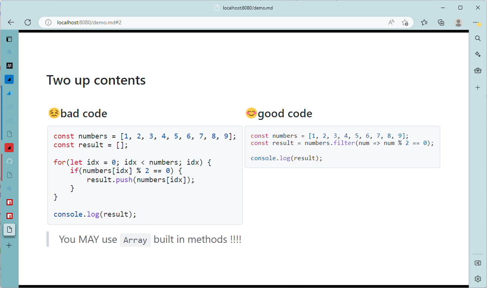
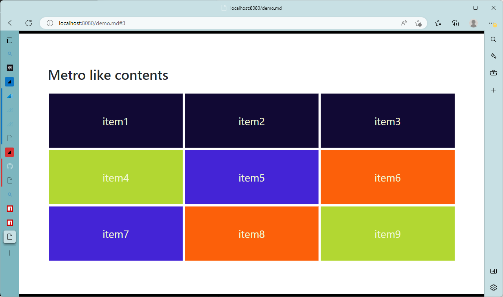

# markdown-it-nested-container

> This package is designed for [Marp](https://marp.app/).

Use `markdown-it-nested-container` as [markdown-it](https://github.com/markdown-it/markdown-it#readme)'s [plugin](https://github.com/markdown-it/markdown-it#plugins-load),
You can write nested `div` container.

## Samples

### Two up slide



### Grid contents (Metro like ?)



## How to install

You can install by `npm install` command like bellow.

```bash
npm install -D @kazumatu981/markdown-it-nested-container
```

## How to use

Here is the how to use `markdow-it-nested container`.
This section introduce how to create Marp slides-deck project,
and introduce how to create Marp slides-deck server.

You can find deltail info in [here](https://marp.app/),
and you can learn about marp plugin eco-system, [here](https://marpit.marp.app/usage?id=extend-marpit-by-plugins).

### **[1st step]** Create Slides-deck project

First, for create slides-deck, you have to prepair to **Marp Project** directory.
So First, Create slides-deck project, and init npm package.

```bash
mkdir myslides
cd myslides

npm init -y
```

Secondary, Build Marp Environment.
Install [@marp-team/marp-cli](https://github.com/marp-team/marp-cli).

```bash
npm install -D @marp-team/marp-cli
```

> Off-course you can install as **global package** (like `npm install -g @marp-team/marp-cli`), or **run at-once** (like `npx`).

### **[2nd step]** Download this project and install

```bash
cd myslides
npm install -D @kazumatu981/markdown-it-nested-container
```


### **[3rd step]** Create `marp.config.js`.

Here is the configuration file for **Marp**.

```javascript
module.exports = {
    inputDir: './slides',
    engine: ({ marp }) => marp.use(require('@kazumatu981/markdown-it-nested-container'))
}
```

### **[4th step]** Create your slides

On `slies` directory. you create slides-deck. like this.

```markdown
---
marp: true
---

<style scoped>
div.grid {
    display: grid;
    grid-template-columns: 1fr 1fr;
}
div.grid-item {
  margin: 3px;
}
</style>

:::grid

+++grid-item
this is **left** content !!
* you can write as Markdown
* triple-marker is mark of container
+++

+++grid-item
this is **right** content !!
1. you can two up slide.
2. using scoped style
3. off course you can use style on custom theme.

> Plese enjoy !

+++

:::
```

### **[5th step]** run server

Run marp server.

```bash
marp -s -c marp.config.js
```


## Detail

### Syntax of Markdown

Markdown means container starts with **start of container syntax**, and ends with **end of conatiner syntax**.

#### start of container syntax

```text
<markers><container-name>[<extend-class-name>][<extend-attribute>]
```

| name                | meaning                                  | syntax                                | Optional |
| ------------------- | ---------------------------------------- | ------------------------------------- | -------- |
| `markers`           | start of container                       | triple-charactors                     | No       |
| `container-name`    | the first class name of container-`DIV`  | string                                | No       |
| `extend-class-name` | additional class name of container-`DIV` | comma or white-space seperated string | No       |
| `extend-attribute`  | attribute of container-`DIV`             | json                                  | No       |

#### end of conatiner syntax

```text
<markers>
```

> The `markers` are equals to start of container's `markers`.

#### sample
```markdown
+++grid-item[metro green]{"style": "color: ivory;"}
here is a contents.
+++
```

### Option of `constructor`

The option is Array of **container defined json**, defined by bellow.

#### container defined json

| property name | type | mean|
|--|--|--|
| `conatainerName` | `string` | the container name. |
| `marker` | `string` | character to use in start/end marker. |
| `validate` | `function` | the function validate container start. see [markdown-it-container](https://www.npmjs.com/package/markdown-it-container) |
| `render` | `function` | the function convert token to HTML. see [markdown-it-container](https://www.npmjs.com/package/markdown-it-container)|

#### default value

```json
[
    {
        containerName: 'grid',
        marker: ':'
    },
    {
        containerName: 'grid-item',
        marker: '+'
    }
]
```

#### Example of `marp.config.js`

```javascript
const MarkdownItNestedContainer = require('@kazumatu981/markdown-it-nested-container');

module.exports = {
    inputDir: './slides',
    engine: ({ marp }) => marp.use(MarkdownItNestedContainer,[
        {
            containerName: 'grid',
            marker: ':'
        },
        {
            containerName: 'grid-item',
            marker: '+'
        },
        {
            containerName: 'flex',
            marker: '@'
        },
        {
            containerName: 'flex-item',
            marker: '%'
        }
    ])
}
```

## Remark

This project depends on [markdown-it-container](https://www.npmjs.com/package/markdown-it-container)

